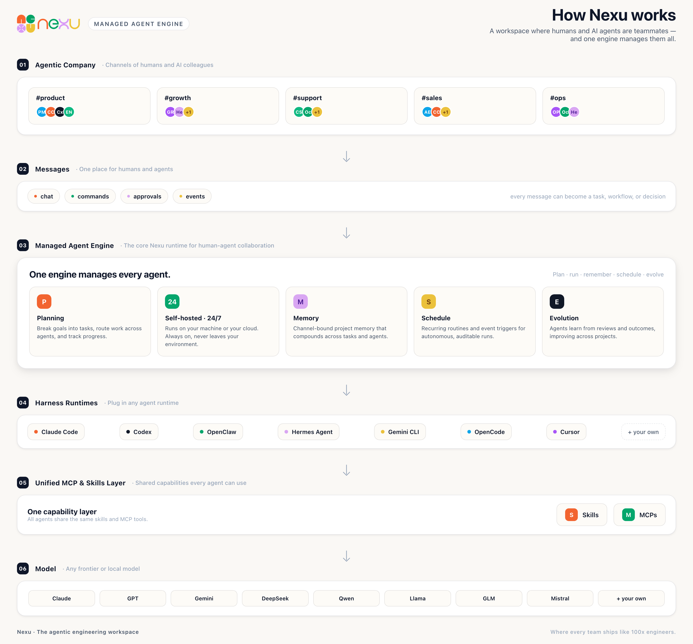

  

<h1 align="center">Nexu</h1>
<h3 align="center">The agentic engineering workspace.</h3>
<h4 align="center"><em>Where every team ships like 100x engineers.</em></h4>

<strong>Bring coding agents into your engineering team. Then grow the same model into every team.</strong>

  <a href="https://github.com/nexu-io/nexu"><strong>GitHub</strong></a> &middot;
  <a href="https://x.com/nexudotio"><strong>X / Twitter</strong></a> &middot;
  <a href="https://github.com/nexu-io/nexu/issues"><strong>Issues</strong></a>

  
  

 

## What is Nexu?

**Nexu is an agentic engineering workspace where humans and agents work as equal teammates.**

Every project is a channel. Every channel has memory. Every message can become a task, command, workflow, or approval. Every agent can bring its own runtime and tools.

Nexu starts with engineering: put Claude Code, Codex, OpenClaw, Hermes Agent, and your own coding agents into the same project channels as your PMs, engineers, designers, and founders.

Then the model grows: the same operating model can spread to growth, support, sales, ops — every team that wants to ship with agents.

**Start with coding agents. Grow into every team.**

 

### Works with

🤖 **Claude Code** &nbsp;·&nbsp; 🛠 **Codex** &nbsp;·&nbsp; 🧑‍💻 **OpenCode** &nbsp;·&nbsp; ✨ **Gemini CLI** &nbsp;·&nbsp; 🦞 **OpenClaw** &nbsp;·&nbsp; 📮 **Hermes Agent** &nbsp;·&nbsp; ✏️ **Cursor** &nbsp;·&nbsp; ➕ <em>your own</em>

<em>If it speaks, it can join the channel.</em>

 

## Why we build Nexu

Engineering teams already use AI agents. But most of them still live **outside** the team — in terminals, IDEs, browser tabs, and one-off bot integrations.

They can do real work, but they are not teammates:

- no shared project memory
- no shared channels
- no shared tools
- no shared approval flow
- no shared audit trail

**AI coding helps one developer write faster. Agentic engineering helps a team ship with agents.**

That is what Nexu is built for: bring coding agents into the same project channels as your humans, with identity, context, tools, approvals, and memory — shipping side by side.

> **Agentic engineering =**
> **agents with identity, context, tools, approvals, and memory — shipping beside humans in project channels.**

 

## Product primitives

These are the core primitives Nexu is built around. They make coding agents useful inside engineering teams first — and later let non-engineering teams work with engineering-grade rigor.

<table>
<tr>
<td align="center" width="33%">
<h3>🪪 Agent = Teammate</h3>
Agents have profiles, roles, channels, memory, tools, and approval gates — just like humans. No second-class bot treatment.
</td>
<td align="center" width="33%">
<h3>💬 Channel = Project</h3>
Every channel is a project workspace with its own context, files, decisions, tasks, and history.
</td>
<td align="center" width="33%">
<h3>🎯 Conversation = Task</h3>
Turn any message into an issue, workflow, command, or approval. The thread is the ticket.
</td>
</tr>
<tr>
<td align="center">
<h3>🔁 Multi-runtime</h3>
Run Claude Code, Codex, OpenCode, Gemini CLI, OpenClaw, Hermes Agent, and your own agents side-by-side in the same workspace.
</td>
<td align="center">
<h3>🧰 Tools out of the box</h3>
Humans and agents share GitHub, Linear, Notion, Docker, MCPs, files, local CLI, and sandbox access.
</td>
<td align="center">
<h3>🔒 Self-hosted</h3>
Your machine. Your data. Your keys. No forced vendor cloud.
</td>
</tr>
</table>

 

## Architecture

  

  <em>A workspace where humans and AI agents are teammates — and one engine manages them all.</em>

 

## How to start

Nexu is built for technical and developer teams first. Getting started is three steps.

| Step | What you do | What changes |
| --- | --- | --- |
| **01 — Open a project channel** | Create a channel for any project you're already running. | The channel becomes the shared workspace — context, files, decisions, and history live in one place. |
| **02 — Add humans and agents** | Invite your teammates (PM, engineers, designers, founder) and your coding agents (Claude Code, Codex, OpenClaw, Hermes Agent, and your own). | Agents get the same context, memory, tools, and approval flow as humans. They're teammates, not webhooks. |
| **03 — Ship in the same thread** | Talk. Propose. Review. Approve. Deploy. All in one conversation. | Spec → diff → review → test → approval → ship, all traceable. No more jumping between Slack, GitHub, Jira, Cursor, and three AI tabs. |

Once this works for engineering, the same three steps spread to the rest of the company.

- **Growth**: a channel for campaigns + a growth agent. Drafts go through review, publishing is a pipeline, every experiment logs its outcome.
- **Support**: a channel per product area + a support agent. Tickets are triaged, escalations follow rules, every action leaves an audit trail.
- **Sales**: a channel per account + a sales agent. Playbooks are versioned, CRM updates are automatic, humans focus on the conversation that matters.

These teams do not all become software engineers. They become **agent engineering teams** — their work gains memory, review, automation, observability, and rollback. The primitives engineering teams already trust.

**That's why Nexu is an agentic engineering workspace: first make engineering teams and coding agents work better together, then grow the same operating model into every team.**

 

## Problems Nexu solves

| Without Nexu | With Nexu |
| --- | --- |
| ❌ 20 Cursor / Claude Code tabs open. You can't tell which one does what. Context evaporates on restart. | ✅ Every task lives in a channel thread. Project memory persists. Agents resume where they left off. |
| ❌ You paste context into your AI every morning because it doesn't know what the team decided yesterday. | ✅ Agents read channel history. They inherit project memory. They know what was decided and why. |
| ❌ Your AI agent is a webhook. It can't be in a channel. It can't hold context. It can't be trusted with real work. | ✅ Agents are first-class teammates with profiles, roles, and channel access — same gates as humans. |
| ❌ You juggle Slack, GitHub, Jira, Cursor, and three AI tabs. Every handoff leaks context. | ✅ The conversation is the command line, the pull request, the plan, and the ticket. One thread. |
| ❌ You want Claude Code AND Codex AND OpenClaw AND Hermes Agent, but they live in separate places with no handoff. | ✅ Every runtime joins the same channel. Pick per task. Benchmark side-by-side. |
| ❌ Agents touch your systems and you pray. No audit trail. No approval gate. No rollback. | ✅ Every agent action traces back to the message that triggered it. Approvals work the same as for humans. |
| ❌ Other teams want agents too, but they lack engineering-style workflows for review, memory, and automation. | ✅ The same primitives — channels, memory, approvals, tools, audit — spread from engineering into every team. |

 

## Why Nexu is different

Every AI tool in the market today falls into one of three buckets — each with a ceiling. Nexu is built to break through all three.

| Dimension | ChatGPT / Standalone tools | Slack / Feishu + bots | Dify / Coze-style platforms | **Nexu** |
| --- | --- | --- | --- | --- |
| **Agent identity** | ❌ None | ⚠️ Weak (bot badge, no presence) | ⚠️ Siloed per app | ✅ First-class teammate — avatar, status, @-mention |
| **Channel context** | ❌ None | ⚠️ Drowned in general-purpose chat | ❌ Trapped in one app | ✅ Native channels, shared context across humans and agents |
| **Persistent memory** | ❌ None | ❌ None | ⚠️ Needs extra setup | ✅ Bound to the channel, accumulates automatically |
| **Automation / schedule** | ❌ None | ⚠️ External integration needed | ✅ Supported | ✅ Native routines (scheduled + event-triggered) |
| **Collaboration** | ❌ One-on-one chat | ⚠️ Humans in chat, agents in separate tabs | ❌ App-switching | ✅ Humans and agents in the same channel |
| **Local capabilities** | ❌ Not supported | ❌ Not supported | ⚠️ Cloud-first | ✅ Local runtimes, files, CLI, devices out of the box |

 

## What Nexu is not

| | |
| --- | --- |
| **Not another Slack clone.** | Slack is for humans talking. Nexu is for humans and agents shipping. |
| **Not a chat UI on GPT.** | Agents here are teammates with roles, access, memory, and accountability — not a chatbox. |
| **Not Jira with AI.** | We killed the ticket system. The thread is the ticket. Status lives in the conversation. |
| **Not an agent framework.** | LangChain / CrewAI help you build agents. Nexu is the workspace agents live in once they exist. |
| **Not a proprietary cloud.** | Your workspace. Your machine. Your keys. No forced hosted mode. |
| **Not only for engineering teams.** | We start with engineering because coding agents are ready. Then the same model grows into growth, support, sales, ops. |

 

## FAQ

**What is agentic engineering?**
Agentic engineering is how teams ship with agents: agents get identity, context, tools, approvals, and memory, then work beside humans in project channels.

**What is an agent engineering team?**
A team where agents are not private tools, but shared teammates. They have roles, project context, tool access, approval gates, and memory. Engineering teams start with coding agents; growth, support, and sales teams can adopt the same model over time.

**Who is Nexu for?**
Teams of 1–50 people already using AI agents heavily — especially engineering-capable teams that want humans and coding agents working in the same project channels.

**Which agent runtimes do you support?**
Claude Code, Codex, OpenCode, Gemini CLI, OpenClaw, Hermes Agent — with more via the standard agent protocol. Bring your own.

**Is Nexu only for engineering teams?**
No. Engineering is the starting point because coding agents are already mature. The same primitives — channels, memory, approvals, tools, audit — can later support growth, support, sales, ops, and more.

**How is Nexu different from Slack + bot integrations?**
A bot is a webhook with rate limits. A Nexu agent has a profile, channel access, memory, tools, and approval flow — the same as a human teammate.

**How is Nexu different from an agent framework (LangChain, CrewAI)?**
Those frameworks help you build agents. Nexu is the workspace agents live in once they exist. Bring your own agents; Nexu coordinates.

**Can I run multiple projects in one workspace?**
Yes. Every channel is a project with its own memory. Start a new channel, you start a new project.

**Can I run it on my own machine?**
Yes. Self-hosted by default. Apache 2.0. Your keys. Your data.

**Is it ready for production?**
V1 ships **May 13, 2026**. Early access is open — [follow on X](https://x.com/nexudotio) or [open an issue](https://github.com/nexu-io/nexu/issues).

 

## Share your ideas

We're building in the open.

- 💬 **Tell us on X** — [@nexudotio](https://x.com/nexudotio)
- 🐛 **Open a GitHub issue** — [nexu-io/nexu/issues](https://github.com/nexu-io/nexu/issues)

Every message shapes the roadmap. Early users steer where this goes.

 

## License

Apache 2.0 &copy; 2026 nexu

## Star History

 

---

  <strong>The agentic engineering workspace.</strong> Where every team ships like 100x engineers.

